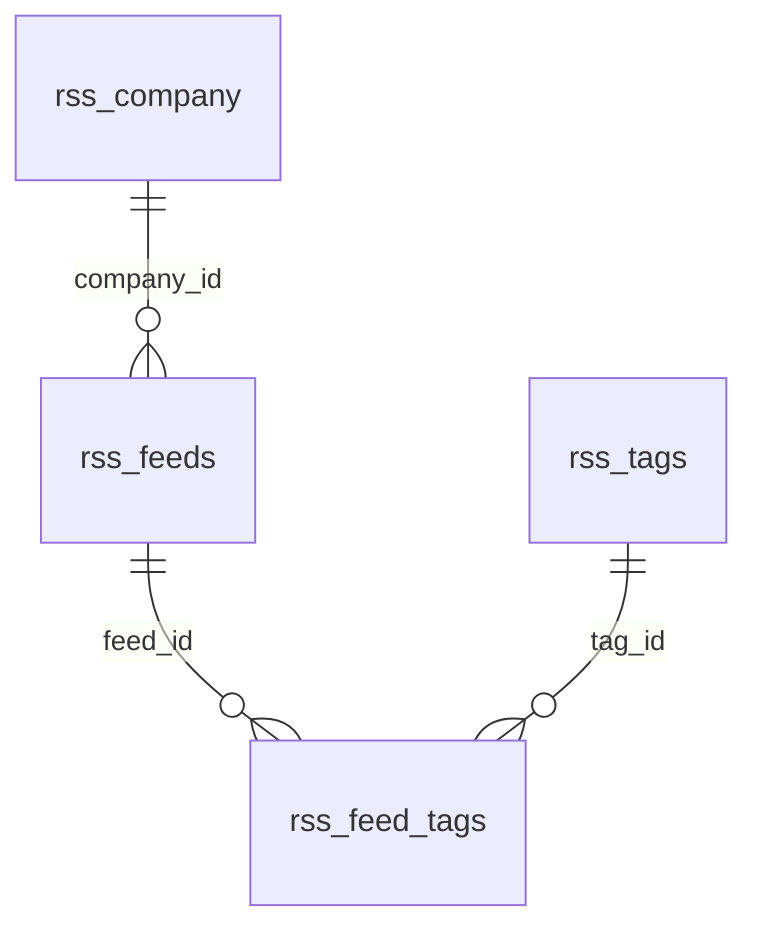

# Table Relations

## Graph (ER)



## Graph (ASCII)

```text
rss_company (1) ---- (0..n) rss_feeds
rss_feeds   (1) ---- (0..n) rss_feed_tags (n..0) ---- (1) rss_tags
```

## Relation Notes
- `rss_company` to `rss_feeds`: one-to-many, optional on feed side (`company_id` nullable).
- `rss_feeds` to `rss_tags`: many-to-many via `rss_feed_tags`.
- Deleting a feed deletes its join rows in `rss_feed_tags`.
- Deleting a tag deletes its join rows in `rss_feed_tags`.
- Deleting a company keeps feeds and sets `company_id` to `NULL`.
