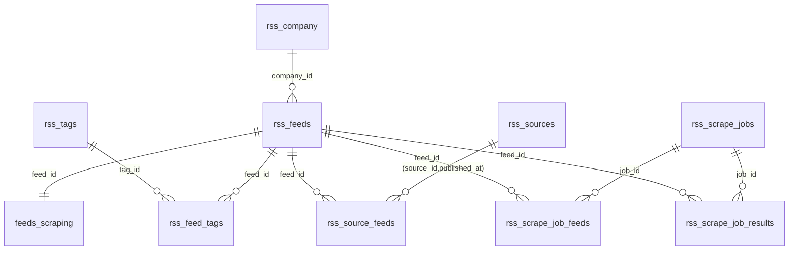

# Table Relations

## Graph (ER)



## Graph (ASCII)

```text
rss_company (1) ---- (0..n) rss_feeds
rss_feeds   (1) ---- (0..n) rss_feed_tags (n..0) ---- (1) rss_tags
rss_feeds   (1) ---- (0..1) feeds_scraping

rss_sources (1) ---- (0..n) rss_source_feeds (n..0) ---- (1) rss_feeds

rss_scrape_jobs (1) ---- (0..n) rss_scrape_job_feeds (n..0) ---- (1) rss_feeds
rss_scrape_jobs (1) ---- (0..n) rss_scrape_job_results (n..0) ---- (1) rss_feeds
```

## Relation Notes

- `rss_company` -> `rss_feeds`: one-to-many, feed side optional (`company_id` nullable).
- `rss_feeds` -> `feeds_scraping`: one-to-one by shared key `feed_id`.
- `rss_feeds` <-> `rss_tags`: many-to-many via `rss_feed_tags`.
- `rss_sources` -> `rss_source_feeds`: linked through composite key (`id`, `published_at`).
- `rss_source_feeds` and `rss_sources` are range-partitioned by `published_at`.
- `rss_scrape_jobs` stores enqueue metadata; details and outcomes are split into:
  - `rss_scrape_job_feeds`
  - `rss_scrape_job_results`
- `rss_scrape_job_results` is idempotent per (`job_id`, `feed_id`) thanks to primary key.
