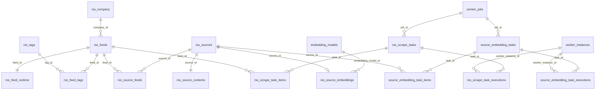

# Table Relations

## Graph (ER)


```mermaid
erDiagram
    rss_company ||--o{ rss_feeds : company_id
    rss_feeds ||--o{ rss_feed_tags : feed_id
    rss_tags ||--o{ rss_feed_tags : tag_id
    rss_feeds ||--|| rss_feed_runtime : feed_id
    rss_sources ||--|| rss_source_contents : source_id
    rss_sources ||--o{ rss_source_feeds : source_id
    rss_feeds ||--o{ rss_source_feeds : feed_id
    embedding_models ||--o{ rss_source_embeddings : embedding_model_id
    rss_sources ||--o| rss_source_embeddings : source_id
    worker_jobs ||--o{ rss_scrape_tasks : job_id
    rss_scrape_tasks ||--o{ rss_scrape_task_items : task_id
    rss_scrape_tasks ||--o{ rss_scrape_task_executions : task_id
    rss_feeds ||--o{ rss_scrape_task_items : feed_id
    worker_instances ||--o{ rss_scrape_task_executions : worker_instance_id
    worker_jobs ||--o{ source_embedding_tasks : job_id
    source_embedding_tasks ||--o{ source_embedding_task_items : task_id
    source_embedding_tasks ||--o{ source_embedding_task_executions : task_id
    rss_sources ||--o{ source_embedding_task_items : source_id
    worker_instances ||--o{ source_embedding_task_executions : worker_instance_id
```

## Graph (ASCII)

```text
rss_company (1) ---- (0..n) rss_feeds
rss_feeds   (1) ---- (0..n) rss_feed_tags (n..0) ---- (1) rss_tags
rss_feeds   (1) ---- (0..1) rss_feed_runtime
rss_sources (1) ---- (0..1) rss_source_contents
rss_sources (1) ---- (0..n) rss_source_feeds (n..0) ---- (1) rss_feeds
rss_sources (1) ---- (0..1) rss_source_embeddings (n..0) ---- (1) embedding_models
worker_jobs (1) ---- (0..n) rss_scrape_tasks (1) ---- (0..n) rss_scrape_task_items (n..0) ---- (1) rss_feeds
worker_jobs (1) ---- (0..n) source_embedding_tasks (1) ---- (0..n) source_embedding_task_items (n..0) ---- (1) rss_sources
```

## Relation Notes

- `rss_company` -> `rss_feeds`: one-to-many, feed side optional (`company_id` nullable).
- `rss_feeds` -> `rss_feed_runtime`: one-to-one by shared key `feed_id`.
- `rss_feeds` <-> `rss_tags`: many-to-many via `rss_feed_tags`.
- `rss_sources` keeps the stable article identity; `rss_source_contents` and `rss_source_feeds` carry the partitioned heavy data.
- `rss_source_contents` and `rss_source_feeds` are range-partitioned by `ingested_at`.
- `worker_jobs` stores request-level orchestration for both workers.
- batched task membership is stored in `rss_scrape_task_items` and `source_embedding_task_items`.
- task lifecycle is split between `*_tasks` and `*_task_executions`; execution rows carry technical history, metrics, and failures.
- `worker_instances` stores the latest runtime state of real workers only.

For the maintained target state, see Alembic revision `v1_initialization.py` and `doc/postgres/review_db_manifeed_simplification_2026-03-10.md`.
